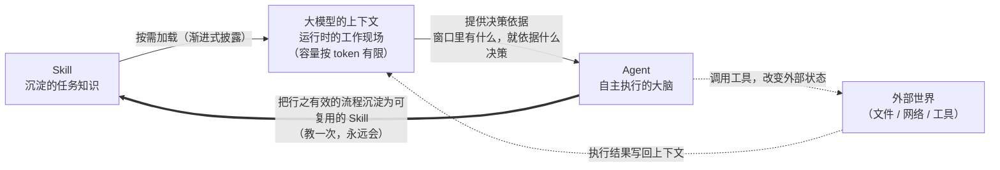

# 概念关系说明：Agent · 大模型的上下文 · Skill

> 本文是 `concept-relationship.html` 的 Markdown 版本（含 Mermaid 图源码），内容一致，便于在 GitHub 上直接渲染和后续修改。

## 三个概念的一句话定位

| 概念 | 一句话定位 | 它回答的问题 |
|------|-----------|-------------|
| **Agent** | 以 LLM 为大脑、在循环中自主调用工具完成目标的系统 | 谁来执行、怎么推进任务 |
| **大模型的上下文** | 模型单次推理能"看见"的全部输入，容量按 token 计的"工作记忆" | 执行时模型能依据什么 |
| **Skill** | 把可复用的任务知识打包成模型可按需加载的文件（SKILL.md + 资源） | 经验如何沉淀、复用与共享 |

**我的总理解：Agent 负责"执行"，上下文是执行的"现场"，Skill 让执行"越做越好、越做越专"。** 三者不是并列的三个功能，而是一个系统里的三种角色。

## 关系图（Mermaid）

## 上下文如何影响 Agent 的工作

上下文是 Agent **唯一的"工作现场"**：它感知的目标、记住的历史、工具返回的反馈，全部要经由上下文进入模型。因此上下文的三个特性直接塑造了 Agent 的工作方式：

1. **有限性 → Agent 必须管理注意力。** 窗口装不下所有信息，所以真实 Agent 系统都用"按需读取"策略：搜索定位、只读相关文件、无关输出不进窗口（完成本作业核实来源时，助手就是按需抓取网页而非全文塞入）。
2. **位置效应 → 重要信息要放对地方。** "迷失在中间"研究表明模型对开头结尾的信息利用最好，所以给 Agent 的关键指令通常放在系统提示（最前），而不是埋在长文档中段。
3. **成本随长度增长 → Agent 的"思考"是有价的。** 注意力计算量随长度平方级增长，Agent 循环越多轮、历史越长，每一步都更贵更慢，这决定了 Agent 的任务拆解不能无限细。

换句话说：**上下文的稀缺性，是 Agent 工程化设计的第一约束。**

## Skill 如何沉淀可复用的任务知识

如果说上下文的特性带来了约束，Skill 就是为化解这种约束而生的工程答案之一：

1. **沉淀：从"易失"到"持久"。** 一段有效的做法如果只存在于对话历史里，会话结束就消失了；写成 SKILL.md 落在磁盘上，就变成了可版本管理、可迭代的资产（本仓库本身就在演示这一点）。
2. **复用：渐进式披露对冲上下文稀缺。** Skill 平时只有 name + description 占据极小的上下文空间，被判断相关时才加载正文，捆绑资源更晚加载——"知识待在磁盘上，需要时才进入现场"。
3. **共享：项目级 Skill 让知识随仓库流动。** 放在仓库 `.workbuddy/skills/` 里的 Skill，对每一个打开这个仓库的人生效，团队约定因此可以像代码一样被 review、被提交。

同时，Skill 也反过来**改变 Agent 的能力边界**：通用 Agent 谁都能用但不专精；加载了某个 Skill 的 Agent 立刻获得该领域的流程、规范和工具知识——就像新员工拿到了入职手册。

## 一个闭环实例：本次作业如何同时用到三者

1. 我（人）在 WorkBuddy 里发出目标：完成作业（此时，一个 **Agent** 开始运转）；
2. 它按需加载了 Skill 创建规范和本仓库的 **Skill**（concept-study-materials 的说明进入它的**上下文**）；
3. 在循环中：检查环境 → 建仓库 → 核实来源（遇到区域受限链接，依据反馈换来源）→ 生成资料 → 自检——每一步的决策都由当时的上下文决定，每一步的执行结果又写回上下文；
4. 最后，"九部分结构 + 来源核实 + 自检清单"这套被验证有效的流程，以 SKILL.md 的形式沉淀下来——下一个概念（比如"假设检验"）可以直接复用。

> **我的个人判断：** 这三个概念里最容易被低估的是**上下文管理**。大家追逐 Agent 的自主性、比拼 Skill 的数量，但日常体验的好坏往往取决于"此刻窗口里放了什么"。同样地，Agent 的能力上限并不等于模型智力，而在于三者的工程组合——这也是为什么"从最简单的方案开始"（Anthropic 的工程建议）比"堆砌复杂框架"更接近用好 AI 的正确路径。

## 参考资料

三个概念的详细出处见各自的学习资料（[agent.html](agent.html) · [llm-context.html](llm-context.html) · [skill.html](skill.html)）第 9 部分参考来源，所有链接均已于 2026-09-04 逐一访问核实。
